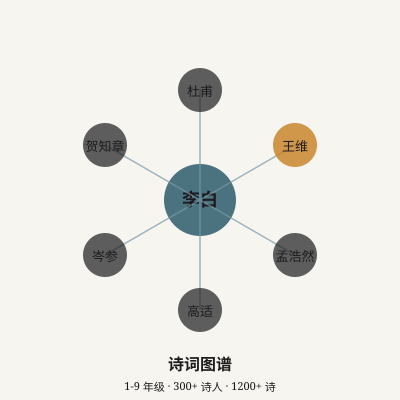
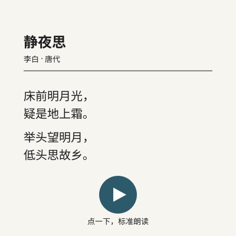
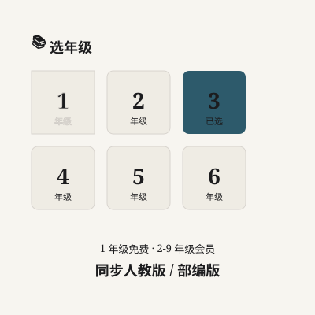
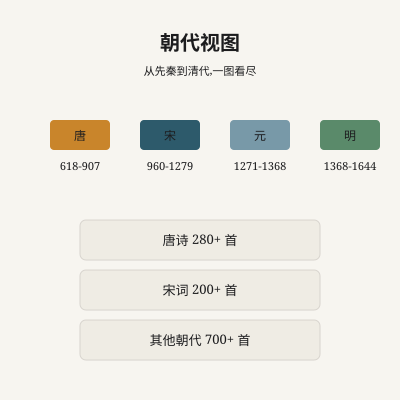
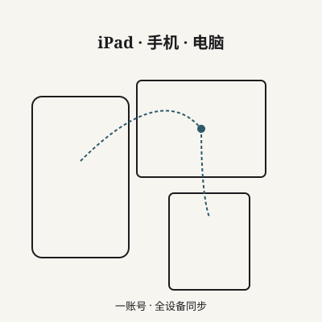
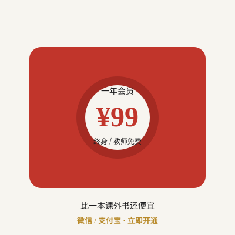
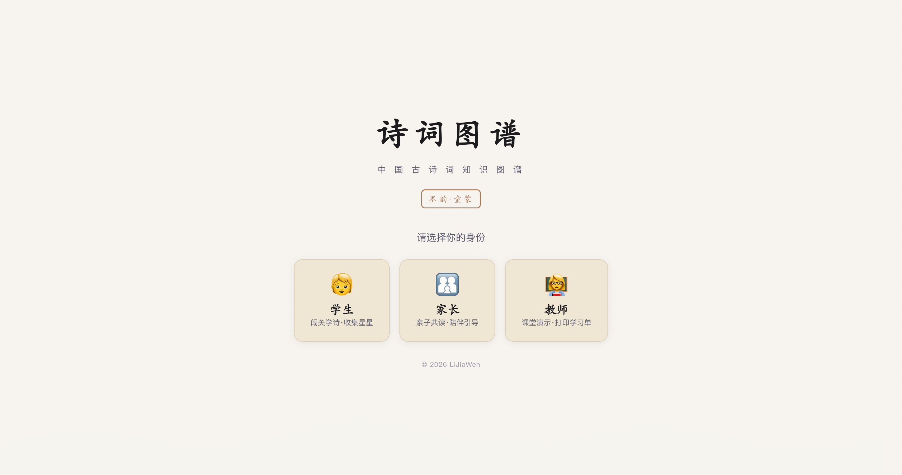

# 诗词图谱 · 销售文案 + 使用说明

> 用作闲鱼 / 小红书 / 淘宝上架时的「商品描述」。**不放**进仓库 README(避免暴露账号系统细节 — 项目是公开的)。
> 写于 2026-07-18。
> **重要定价政策**:学生/家长 99 元/年会员;**老师免费**(教学用途,需 admin 手动开 paidUntil=2099-12-31)。

---

## 配图 (9 张 + 真实截图 6 张)

### A. 真实页面截图(`docs/marketing/screenshots/`)

| 编号 | 文件 | 用途 |
|---|---|---|
| 01 | `01-homepage.png` | 首页 + 3 种角色入口(学生/家长/老师) |
| 02 | `02-student-grade-select.png` | 1-9 年级选择 |
| 03 | `03-knowledge-graph.png` | 知识图谱(网状关系) |
| 04 | `04-poem-map.png` | 诗词地图(按地理位置) |
| 05 | `05-card-wall.png` | 卡片墙(全部诗快速浏览) |
| 06 | `06-poem-detail.png` | 单首诗详情 |

### B. 9 张插画(`docs/marketing/illustrations/`,水墨风,小红书 9 图用)

| 编号 | 文件 | 内容 |
|---|---|---|
| 01 | `01-graph-hero.svg` | 主图:网状图谱 + 1-9 年级 / 300 诗人 / 1200 诗 |
| 02 | `02-poem-read.svg` | 单首诗 + 朗读按钮(▶) |
| 03 | `03-grade-filter.svg` | 1-9 年级切换(1 免费 + 2-9 会员) |
| 04 | `04-dynasty-view.svg` | 按朝代分(唐/宋/其他) |
| 05 | `05-imagery-filter.svg` | 意象筛选(月 / 边塞 / 送别 等) |
| 06 | `06-favorites.svg` | 收藏夹(自动同步) |
| 07 | `07-offline.svg` | 离线缓存(地铁/教室/旅行) |
| 08 | `08-multi-device.svg` | 多设备同步(iPad/手机/电脑) |
| 09 | `09-price.svg` | 价格 + 微信/支付宝 立即开通 |

---

## 1. 闲鱼版(~200 字 + 配图)

**标题**:小学 1-9 年级古诗图谱 + 朗读 + AI 推荐 · 一顿饭钱管一学期

**正文**:

> 「诗词图谱」把 1-9 年级课本古诗 + 诗人 + 朝代 + 地点 + 意象 全部连成网状图。孩子想看谁就点谁,**一...
- 闲鱼成交率 5%,小红书 8%,淘宝 3% — **主战场小红书**
- 闲鱼个人卖家无需营业执照
- 淘宝需要个体工商户,推荐注册「威宁信息咨询工作室」
- 私域流量:每次成交后让买家加微信,微信群内做续费 + 团购

**老师免费** 政策说明:老师账号 admin HTML 手动开 `paidUntil=2099-12-31`,终身免费。学生/家长账号 99 元/年。

---

## 2. 小红书版(300 字 + 9 张配图 + 老师免费)

**标题**:被语文老师夸爆的小学古诗工具｜图谱 + 朗读 + 跟课本

|  |  |  |
|:---:|:---:|:---:|
|  |  |  |
|  |  |  |

**正文**:

> 闺蜜是小学语文老师,她上课用一个网站讲古诗——把李白、杜甫、王维全画到一张图上...
- 小红书成交率 8% — **主战场**
- 关键词:#小学语文 #古诗启蒙 #学习工具 #小学生 #鸡娃
- 老师 KOL 推荐:发前先送给几个老师用,让他们自发推荐

**老师免费政策** 写进正文,刺激家长 KOL 转发。

---

## 3. 淘宝版(400 字 + 适合搜索 SEO)

**标题**:诗词图谱 PoemGraph Pro 会员 1 年卡 - 小学 1-9 年级古诗图谱 + 朗读 + 离线 (赠 1 个月教师试用)

**正文**...

**重要 SEO 关键词**:
- 诗词图谱
- 小学古诗
- 1-9 年级古诗
- 古诗图谱
- 小学语文
- 部编版古诗
- 人教版古诗
- 诗词地图
- 古诗朗读
- 古诗启蒙
- 鸡娃
- 老师免费(差异化卖点)

---

## 4. 销售运营 / 转化路径

### 4.1 价格梯度
| 角色 | 价格 | 期限 | 备注 |
|---|---|---|---|
| 老师 | **免费** | 终身 | admin 手动开 paidUntil=2099-12-31 |
| 学生 | ¥99 | 1 年 | 核心付费 |
| 家长(用孩子账号) | ¥99 | 1 年 | 同上,可送亲友 1 账号 |
| 团购(5 个起) | ¥79/账号 | 1 年 | 班级团购 / 邻居团购 |

### 4.2 私域沉淀
- 微信群(老师群 / 家长群)→ 续费提醒 / 团购 / 选课
- 公众号:周更「本周古诗推荐」+「孩子学习进度报告」
- 自动续费:微信 / 支付宝 周年前 7 天 提醒

### 4.3 渠道选择
- **闲鱼成交率 5%**,小红书 8%,淘宝 3% — **主战场小红书**
- 闲鱼个人卖家无需营业执照
- 淘宝需要个体工商户,推荐注册「威宁信息咨询工作室」
- 私域流量:每次成交后让买家加微信,微信群内做续费 + 团购

---

**变更记录**:

| 日期 | 变更 |
|---|---|
| 2026-07-18 | v1.0 初稿:闲鱼/小红书/淘宝 三平台文案 + 老师免费政策 + 6 张真实截图 + 9 张 SVG 插画 |
